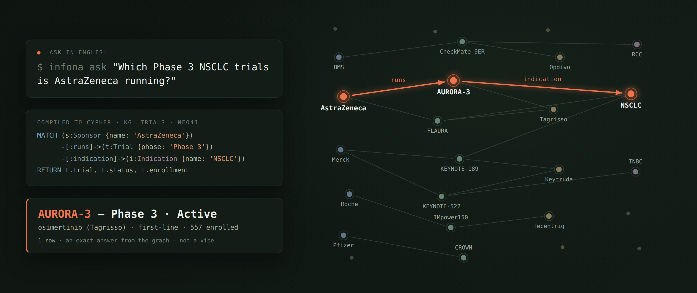

<p align="center">
  <picture>
    <source media="(prefers-color-scheme: dark)" srcset="docs/brand/infona-lockup-reverse-tight.png">
    
  </picture>
</p>

<p align="center">
  <strong>The knowledge layer your vertical agent actually queries.</strong><br/>
  One LLM pass infers the schema. Every row maps deterministically.<br/>
  Ask in English. Get an exact answer from <strong>Cypher on Neo4j</strong> — not a vibe.
</p>

<p align="center">
  <a href="https://infona.ai">infona.ai</a> ·
  <a href="docs/BOUNDARY.md">what's free</a> ·
  <a href="docs/API.md">API</a>
</p>

<p align="center">
  <a href="docs/API.md"></a>
  <a href="LICENSE"></a>
  <a href="https://www.python.org/downloads/"></a>
  <a href="https://github.com/astral-sh/uv"></a>
  <a href="https://pydantic.dev"></a>
  <a href="docs/neo4j-local.md"></a>
  <a href="https://www.npmjs.com/package/@infona-ai/mcp"></a>
  <a href="https://github.com/infona-ai/infona-oss/actions/workflows/test.yml"></a>
</p>

<p align="center">
  <a href="https://github.com/infona-ai/infona-oss/stargazers"></a>
</p>

<p align="center">
  
</p>

<p align="center"><em>The whole loop in one frame: English in, Cypher on the populated graph, one exact row out.</em></p>

You're building a vertical agent. The hard part isn't the model — it's the messy table behind it. Infona **structures** it: types, relationships, a real graph. Then `/ask` compiles the question to Cypher and runs it.

```bash
infona ingest examples/trials.csv --kg trials
infona ask "Which Phase 3 NSCLC trials is AstraZeneca running?" --kg trials
```

That's the whole product loop. Schema once. Query cheaply.

---

## See it happen

Ingest is one LLM call for the *shape*, then a deterministic write of every row. You review the inferred schema before anything is written, and the graph assembles tier by tier as rows land:



Then the agent asks the landscape question a flat file makes painful — every match lights as its clause compiles. A schematic of the plan `/ask` builds (`--debug` shows the real one), not a captured dump:



Three sponsors converge on NSCLC because the CSV says so: those are instance edges (`onto/runs`, `onto/indication`), and re-asking tomorrow lights the same nodes. `examples/trials.csv` is a 16-row oncology sample (8 sponsors, 11 drugs, 7 indications) — public program names, synthetic `TRIAL-*` IDs, no patient data.

The looping SVGs are generated (no JS, no video) from [`scripts/render_readme_demos.py`](scripts/render_readme_demos.py); the hero still comes from [`scripts/render_readme_hero.py`](scripts/render_readme_hero.py). Same node and edge data in every asset.

---

## What you get

| | |
|---|---|
| **Schema from one pass** | Luna (or your configured model) sees the file once. Types, attributes, relationships. No per-row LLM. |
| **Deterministic rows** | Every cell maps through that schema. Re-ingest is idempotent. |
| **A real graph** | Neo4j. Sponsors, trials, drugs, indications are nodes — not columns you `JOIN` by hand. |
| **Ask → Cypher** | Always-LLM Cypher. Grounded on the *populated* ontology, fail-closed when the plan is a silent wrong total. |
| **CLI + MCP + HTTP** | Same canonical routes. `infona`, `@infona-ai/mcp`, `/graphs/{tenant}/ask`. |
| **Export** | JSON or CSV back out. The graph is yours. |

Not a vector index. Not "chat with your CSV." A knowledge layer you can count on.

---

## 10-minute quickstart

**Need:** Docker, Node 20+ (for the `infona` CLI), and an OpenRouter key. Schema inference and `/ask` both call an LLM — there is no key-free ingest of this CSV.

```bash
git clone https://github.com/infona-ai/infona-oss.git && cd infona-oss
cp .env.example .env          # set OPENROUTER_API_KEY=sk-or-...
npm i -g @infona-ai/cli       # or use npx @infona-ai/cli in place of infona
./scripts/oss_up.sh           # Neo4j + API + local CLI config
infona ingest examples/trials.csv --kg trials
infona ask "Which Phase 3 NSCLC trials is AstraZeneca running?" --kg trials
```

That question should return **FLAURA2**. `./scripts/oss_up.sh` is the one-shot: compose up, wait until `/health` reports Neo4j up, write `~/.infona/config.json`. After that, bare `infona` works. `infona init --local` is the same connect without starting Docker.

Python package (library, not the `infona` CLI — that is `@infona-ai/cli`):

```bash
pip install "infona-client @ git+https://github.com/infona-ai/infona-oss.git"
```

If something fails, the CLI should name the next command (`./scripts/oss_up.sh`, `docker compose up -d neo4j`, `OPENROUTER_API_KEY`, `infona ingest …`). Local Neo4j notes: [docs/neo4j-local.md](docs/neo4j-local.md). Import path is `infona_client`. Graph IRIs live under `https://graph.infona.ai/`.

---

## MCP (agents)

This layer is built to be called by *your* agent, not just a human at a CLI. Same `ask`, same graph, same exact rows — arriving as a tool result instead of terminal output:



```json
{
  "mcpServers": {
    "infona": {
      "command": "npx",
      "args": ["-y", "-p", "@infona-ai/mcp", "infona-mcp"],
      "env": {
        "INFONA_API_URL": "http://localhost:8000",
        "INFONA_TENANT": "default"
      }
    }
  }
}
```

`ask`, `search`, `agent`, `ingest_csv`, `export_kg`, ontology, jobs — same backend the CLI hits. [packages/mcp/README.md](packages/mcp/README.md).

---

## What's free

- **OSS (this repo):** ingest, ontology, ask, MCP / CLI / HTTP, export, free sources, BYOK registry, plugin seams.
- **Bring your own retrieval:** OSS registers **no** open-web page fetcher. Enrichment that needs a URL fetch declines unless *you* register one — or you use hosted Infona.
- **Hosted-only:** managed keys Infona bills, paid search/scrape ladders, curated Enhanced ontology, Explorer, billing.

Full table: **[docs/BOUNDARY.md](docs/BOUNDARY.md)**.

---

## How it works

```
CSV / JSON / text
  → schema inference (1 LLM call)
  → deterministic row mapping
  → Neo4j knowledge graph (GraphStore / Cypher)
  → natural language → Cypher → exact answer
```

Ask is always-LLM Cypher. Grounding, probes, and few-shots **inform** the model; they do not replace it. Don't short-circuit production `/ask` with golden strings.

```bash
export OPENROUTER_API_KEY=sk-or-...
export INFONA_QUERY_PROVIDER=openrouter
export INFONA_QUERY_MODEL=openai/gpt-oss-120b
```

With an OpenRouter key, OSS auto-embeds ontology types as the catalog grows (and on first `/ask` if the index is empty). Indexes live under `~/.infona/embeddings/`.

---

## Architecture

**Product path:** FastAPI + **Neo4j GraphStore (Cypher)**. SPARQL / Neptune are not product backends.

- Ingestion: LLM schema → deterministic mapping
- Query: populated ontology + few-shot bank → Cypher
- Writes: `insert_facts` / `refresh_after_write` (one write path)
- Instance relationships: `https://graph.infona.ai/onto/<leaf>`

[docs/BOUNDARY.md](docs/BOUNDARY.md) is current.

---

## License

Apache 2.0 — [LICENSE](LICENSE), [NOTICE](NOTICE).
Contributions: [CLA.md](CLA.md), [CONTRIBUTING.md](CONTRIBUTING.md).
Agents: **[AGENTS.md](AGENTS.md)**.
