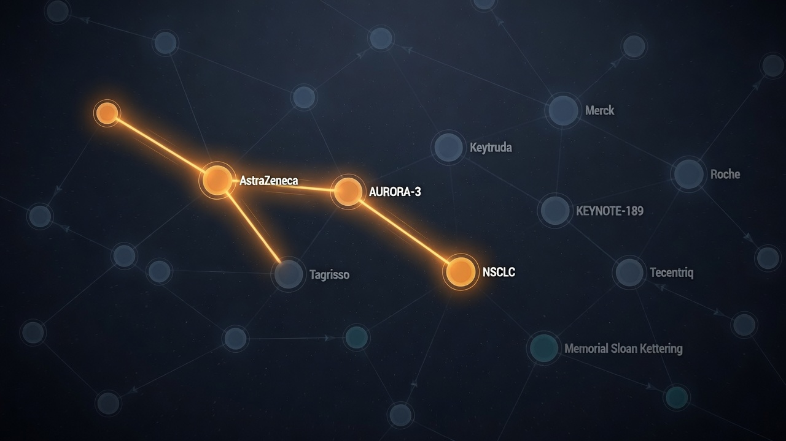

<p align="center">
  <picture>
    <source media="(prefers-color-scheme: dark)" srcset="docs/brand/infona-lockup-reverse-tight.png">
    
  </picture>
</p>

<p align="center">
  <strong>The context graph your vertical agent actually queries.</strong><br/>
  One LLM pass infers the schema. Every row maps deterministically.<br/>
  Ask in English. Get an exact answer from <strong>Cypher on Neo4j</strong> — not a vibe.
</p>

<p align="center">
  <a href="https://infona.ai">infona.ai</a> ·
  <a href="docs/BOUNDARY.md">what's free</a> ·
  <a href="docs/API.md">API</a> ·
  <a href="https://github.com/infona-ai/structure-once-query-cheaply">paper freeze</a>
</p>

<p align="center">
  
</p>

<p align="center"><em>A field-medical / CI agent’s graph: sponsors, trials, drugs, indications. The path is the answer — AstraZeneca → AURORA-3 → NSCLC.</em></p>

You're building a vertical agent. The hard part isn't the model — it's the messy table behind it. Infona **structures** it: types, relationships, a real graph. Then `/ask` compiles the question to Cypher and runs it.

```bash
infona ingest examples/trials.csv --kg trials
infona ask "Which Phase 3 NSCLC trials is AstraZeneca running?" --kg trials
```

That's the whole product loop. Schema once. Query cheaply.

---

## See it happen

Ingest is one LLM call for the *shape*, then a deterministic write of every row. The graph grows as entities land:



Then the agent queries the graph instead of grepping the file. The path lights hop by hop — schematic of the plan `/ask` compiles, not a captured debug dump:



The CSV said AstraZeneca runs AURORA-3, and AURORA-3 is NSCLC / Tagrisso. Those are instance edges (`onto/runs`, `onto/indication`). Re-ask tomorrow and the same nodes answer. `examples/trials.csv` is a 16-row oncology sample (8 sponsors, 11 drugs, 7 indications) — public program names, synthetic `TRIAL-*` IDs, no patient data.

The looping SVGs are generated (no JS) from [`scripts/render_readme_demos.py`](scripts/render_readme_demos.py).

---

## What you get

| | |
|---|---|
| **Schema from one pass** | Luna (or your configured model) sees the file once. Types, attributes, relationships. No per-row LLM. |
| **Deterministic rows** | Every cell maps through that schema. Re-ingest is idempotent. |
| **A real graph** | Neo4j. Sponsors, trials, drugs, indications are nodes — not columns you `JOIN` by hand. |
| **Ask → Cypher** | Always-LLM Cypher. Grounded on the *populated* ontology, fail-closed when the plan is a silent wrong total. |
| **CLI + MCP + HTTP** | Same canonical routes. `infona`, `@infona-ai/mcp`, `/graphs/{tenant}/ask`. |
| **Export** | JSON or CSV back out. The graph is yours. |

Not a vector index. Not "chat with your CSV." A context graph you can count on.

---

## 10-minute quickstart

**Need:** Docker (Neo4j) and an LLM key (OpenRouter is the honest default). Without both, install still works — graph routes will not.

```bash
python -m venv .venv && source .venv/bin/activate
pip install -e ".[dev]"
cp .env.example .env          # set OPENROUTER_API_KEY=sk-or-...

docker compose up -d          # Neo4j only
export NEO4J_URI=bolt://localhost:7687
export NEO4J_USER=neo4j
export NEO4J_PASSWORD=infona-dev-password
export INFONA_GRAPH_BACKEND=neo4j

python - <<'PY'
import asyncio
from infona_client.graph.store import get_graph_store
async def main():
    store = get_graph_store()
    print(await store.bootstrap_schema())
    await store.close()
asyncio.run(main())
PY

set -a && source .env && set +a
uvicorn infona_client.api.app:create_app --factory --port 8000
```

In another shell:

```bash
./scripts/oss_setup.sh        # writes ~/.infona/config.json for local open-access
infona ingest examples/trials.csv --kg trials
infona ask "Which Phase 3 NSCLC trials is AstraZeneca running?" --kg trials
infona export --kg trials -f json -o trials.json
```

`./scripts/oss_setup.sh` (or `infona init --local`) is the one-shot local connect. After that, bare `infona` works. `--local` is a one-off flag and does not rewrite config.

Local Neo4j notes: [docs/neo4j-local.md](docs/neo4j-local.md). Import path is `infona_client`. Graph IRIs live under `https://graph.infona.ai/`.

---

## MCP (agents)

```json
{
  "mcpServers": {
    "infona": {
      "command": "npx",
      "args": ["-y", "-p", "@infona-ai/mcp", "infona-mcp"],
      "env": {
        "INFONA_API_URL": "http://localhost:8000",
        "INFONA_TENANT": "default"
      }
    }
  }
}
```

`ask`, `search`, `agent`, `ingest_csv`, `export_kg`, ontology, jobs — same backend the CLI hits. [packages/mcp/README.md](packages/mcp/README.md).

---

## What's free

- **OSS (this repo):** ingest, ontology, ask, MCP / CLI / HTTP, export, free sources, BYOK registry, plugin seams.
- **Bring your own retrieval:** OSS registers **no** open-web page fetcher. Enrichment that needs a URL fetch declines unless *you* register one — or you use hosted Infona.
- **Hosted-only:** managed keys Infona bills, paid search/scrape ladders, curated Enhanced ontology, Explorer, billing.

Full table: **[docs/BOUNDARY.md](docs/BOUNDARY.md)**. This repo is the product runtime, not the eval-MH paper freeze ([structure-once-query-cheaply](https://github.com/infona-ai/structure-once-query-cheaply)).

---

## How it works

```
CSV / JSON / text
  → schema inference (1 LLM call)
  → deterministic row mapping
  → Neo4j knowledge graph (GraphStore / Cypher)
  → natural language → Cypher → exact answer
```

Ask is always-LLM Cypher. Grounding, probes, and few-shots **inform** the model; they do not replace it. Don't short-circuit production `/ask` with golden strings.

```bash
export OPENROUTER_API_KEY=sk-or-...
export INFONA_QUERY_PROVIDER=openrouter
export INFONA_QUERY_MODEL=openai/gpt-oss-120b
```

With an OpenRouter key, OSS auto-embeds ontology types as the catalog grows (and on first `/ask` if the index is empty). Indexes live under `~/.infona/embeddings/`.

---

## Architecture

**Product path:** FastAPI + **Neo4j GraphStore (Cypher)**. SPARQL / Neptune are not product backends.

- Ingestion: LLM schema → deterministic mapping
- Query: populated ontology + few-shot bank → Cypher
- Writes: `insert_facts` / `refresh_after_write` (one write path)
- Instance relationships: `https://graph.infona.ai/onto/<leaf>`

[docs/BOUNDARY.md](docs/BOUNDARY.md) is current. [ARCHITECTURE.md](ARCHITECTURE.md) is a historical SPARQL-era write-up.

---

## License

Apache 2.0 — [LICENSE](LICENSE), [NOTICE](NOTICE).
Contributions: [CLA.md](CLA.md), [CONTRIBUTING.md](CONTRIBUTING.md).
Agents: **[AGENTS.md](AGENTS.md)**.
